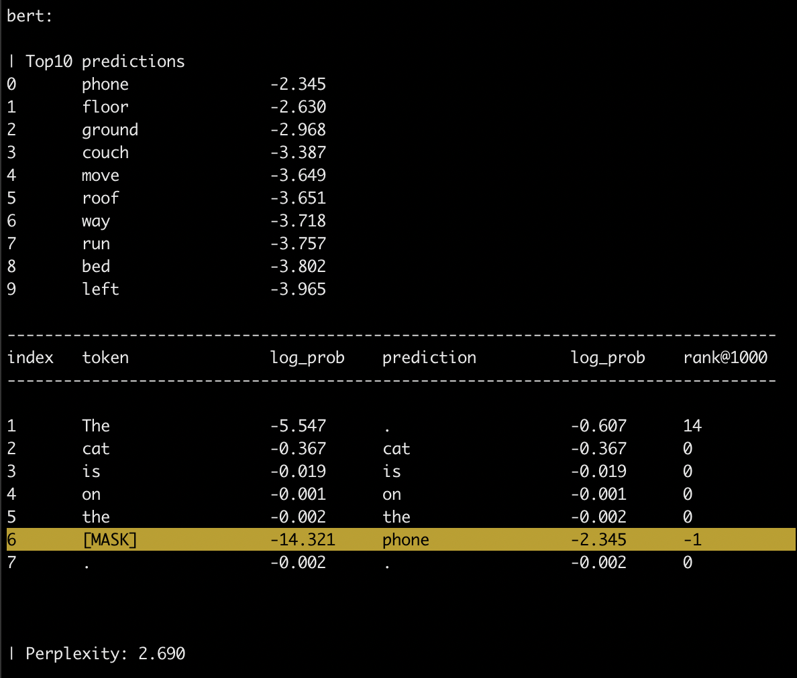

# LAMA: LAnguage Model Analysis


LAMA is a probe for analyzing the factual and commonsense knowledge contained in pretrained language models. <br>
#### The dataset for the LAMA probe is available at https://dl.fbaipublicfiles.com/LAMA/data.zip <br>
LAMA contains a set of connectors to pretrained language models. <br>
LAMA exposes a transparent and unique interface to use:

- Transformer-XL (Dai et al., 2019)
- BERT (Devlin et al., 2018)
- ELMo (Peters et al., 2018)
- GPT (Radford et al., 2018)
- RoBERTa (Liu et al., 2019)

Actually, LAMA is also a beautiful animal.

## Reference:

The LAMA probe is described in the following papers:

```bibtex
@inproceedings{petroni2019language,
  title={Language Models as Knowledge Bases?},
  author={F. Petroni, T. Rockt{\"{a}}schel, A. H. Miller, P. Lewis, A. Bakhtin, Y. Wu and S. Riedel},
  booktitle={In: Proceedings of the 2019 Conference on Empirical Methods in Natural Language Processing (EMNLP), 2019},
  year={2019}
}

@inproceedings{petroni2020how,
  title={How Context Affects Language Models' Factual Predictions},
  author={Fabio Petroni and Patrick Lewis and Aleksandra Piktus and Tim Rockt{\"a}schel and Yuxiang Wu and Alexander H. Miller and Sebastian Riedel},
  booktitle={Automated Knowledge Base Construction},
  year={2020},
  url={https://openreview.net/forum?id=025X0zPfn}
}
```

## The LAMA probe

To reproduce our results:

### 1. Create conda environment and install requirements

(optional) It might be a good idea to use a separate conda environment. It can be created by running:
```
conda create -n lama37 -y python=3.7 && conda activate lama37
pip install -r requirements.txt
```

### 2. Download the data

```bash
wget https://dl.fbaipublicfiles.com/LAMA/data.zip
unzip data.zip
rm data.zip
```

### 3. Download the models

#### DISCLAIMER: ~55 GB on disk

Install spacy model
```bash
python3 -m spacy download en
```

Download the models
```bash
chmod +x download_models.sh
./download_models.sh
```

The script will create and populate a _pre-trained_language_models_ folder.
If you are interested in a particular model please edit the script.


### 4. Run the experiments

```bash
python scripts/run_experiments.py
```

results will be logged in _output/_ and  _last_results.csv_.

## Other versions of LAMA

### LAMA-UHN

This repository also provides a script (`scripts/create_lama_uhn.py`) to create the data used in (Poerner et al., 2019).

### Negated-LAMA
This repository also gives the option to evalute how pretrained language models handle negated probes (Kassner et al., 2019), set the flag `use_negated_probes` in `scripts/run_experiments.py`. Also, you should use this version of the LAMA probe https://dl.fbaipublicfiles.com/LAMA/negated_data.tar.gz

## What else can you do with LAMA?

### 1. Encode a list of sentences
and use the vectors in your downstream task!

```bash
pip install -e git+https://github.com/facebookresearch/LAMA#egg=LAMA
```

```python
import argparse
from lama.build_encoded_dataset import encode, load_encoded_dataset

PARAMETERS= {
        "lm": "bert",
        "bert_model_name": "bert-large-cased",
        "bert_model_dir":
        "pre-trained_language_models/bert/cased_L-24_H-1024_A-16",
        "bert_vocab_name": "vocab.txt",
        "batch_size": 32
        }

args = argparse.Namespace(**PARAMETERS)

sentences = [
        ["The cat is on the table ."],  # single-sentence instance
        ["The dog is sleeping on the sofa .", "He makes happy noises ."],  # two-sentence
        ]

encoded_dataset = encode(args, sentences)
print("Embedding shape: %s" % str(encoded_dataset[0].embedding.shape))
print("Tokens: %r" % encoded_dataset[0].tokens)

# save on disk the encoded dataset
encoded_dataset.save("test.pkl")

# load from disk the encoded dataset
new_encoded_dataset = load_encoded_dataset("test.pkl")
print("Embedding shape: %s" % str(new_encoded_dataset[0].embedding.shape))
print("Tokens: %r" % new_encoded_dataset[0].tokens)
```

### 2. Fill a sentence with a gap.

You should use the symbol ```[MASK]``` to specify the gap.
Only single-token gap supported - i.e., a single ```[MASK]```.
```bash
python lama/eval_generation.py  \
--lm "bert"  \
--t "The cat is on the [MASK]."
```


<sub><sup>source: https://commons.wikimedia.org/wiki/File:Bluebell_on_the_phone.jpg</sup></sub>

Note that you could use this functionality to answer _cloze-style_ questions, such as:

```bash
python lama/eval_generation.py  \
--lm "bert"  \
--t "The theory of relativity was developed by [MASK] ."
```


## Install LAMA with pip

Clone the repo
```bash
git clone git@github.com:facebookresearch/LAMA.git && cd LAMA
```
Install as an editable package:
```bash
pip install --editable .
```

If you get an error in mac os x, please try running this instead
```bash
CFLAGS="-Wno-deprecated-declarations -std=c++11 -stdlib=libc++" pip install --editable .
```


## Language Model(s) options

Option to indicate which language model(s) to use:
* __--language-models/--lm__ : comma separated list of language models (__REQUIRED__)

### BERT
BERT pretrained models can be loaded both: (i) passing the name of the model and using huggingface cached versions or (ii) passing the folder containing the vocabulary and the PyTorch pretrained model (look at convert_tf_checkpoint_to_pytorch in [here](https://github.com/huggingface/pytorch-pretrained-BERT) to convert the TensorFlow model to PyTorch).

* __--bert-model-dir/--bmd__ : directory that contains the BERT pre-trained model and the vocabulary
* __--bert-model-name/--bmn__ : name of the huggingface cached versions of the BERT pre-trained model (default = 'bert-base-cased')
* __--bert-vocab-name/--bvn__ : name of vocabulary used to pre-train the BERT model (default = 'vocab.txt')


### RoBERTa

* __--roberta-model-dir/--rmd__ : directory that contains the RoBERTa pre-trained model and the vocabulary (__REQUIRED__)
* __--roberta-model-name/--rmn__ : name of the RoBERTa pre-trained model (default = 'model.pt')
* __--roberta-vocab-name/--rvn__ : name of vocabulary used to pre-train the RoBERTa model (default = 'dict.txt')


### ELMo

* __--elmo-model-dir/--emd__ : directory that contains the ELMo pre-trained model and the vocabulary (__REQUIRED__)
* __--elmo-model-name/--emn__ : name of the ELMo pre-trained model (default = 'elmo_2x4096_512_2048cnn_2xhighway')
* __--elmo-vocab-name/--evn__ : name of vocabulary used to pre-train the ELMo model (default = 'vocab-2016-09-10.txt')


### Transformer-XL

* __--transformerxl-model-dir/--tmd__ : directory that contains the pre-trained model and the vocabulary (__REQUIRED__)
* __--transformerxl-model-name/--tmn__ : name of the pre-trained model (default = 'transfo-xl-wt103')


### GPT

* __--gpt-model-dir/--gmd__ : directory that contains the gpt pre-trained model and the vocabulary (__REQUIRED__)
* __--gpt-model-name/--gmn__ : name of the gpt pre-trained model (default = 'openai-gpt')


## Evaluate Language Model(s) Generation

options:
* __--text/--t__ : text to compute the generation for
* __--i__ : interactive mode <br>
one of the two is required

example considering both BERT and ELMo:
```bash
python lama/eval_generation.py \
--lm "bert,elmo" \
--bmd "pre-trained_language_models/bert/cased_L-24_H-1024_A-16/" \
--emd "pre-trained_language_models/elmo/original/" \
--t "The cat is on the [MASK]."
```

example considering only BERT with the default pre-trained model, in an interactive fashion:
```bash
python lamas/eval_generation.py  \
--lm "bert"  \
--i
```


## Get Contextual Embeddings

```bash
python lama/get_contextual_embeddings.py \
--lm "bert,elmo" \
--bmn bert-base-cased \
--emd "pre-trained_language_models/elmo/original/"
```

## Unified vocabulary
The intersection of the vocabularies for all considered models
- [cased](https://dl.fbaipublicfiles.com/LAMA/common_vocab_cased.txt)
- [lowercased](https://dl.fbaipublicfiles.com/LAMA/common_vocab_lowercased.txt)

## Troubleshooting

If the module cannot be found, preface the python command with `PYTHONPATH=.`

If the experiments fail on GPU memory allocation, try reducing batch size.

## Acknowledgements

* [https://github.com/huggingface/pytorch-pretrained-BERT](https://github.com/huggingface/pytorch-pretrained-BERT)
* [https://github.com/allenai/allennlp](https://github.com/allenai/allennlp)
* [https://github.com/pytorch/fairseq](https://github.com/pytorch/fairseq)


## Other References

- __(Kassner et al., 2019)__ Nora Kassner, Hinrich Schütze. _Negated LAMA: Birds cannot fly_. arXiv preprint arXiv:1911.03343, 2019.

- __(Poerner et al., 2019)__ Nina Poerner, Ulli Waltinger, and Hinrich Schütze. _BERT is Not a Knowledge Base (Yet): Factual Knowledge vs. Name-Based Reasoning in Unsupervised QA_. arXiv preprint arXiv:1911.03681, 2019.

- __(Dai et al., 2019)__ Zihang Dai, Zhilin Yang, Yiming Yang, Jaime G. Carbonell, Quoc V. Le, and Ruslan Salakhutdi. _Transformer-xl: Attentive language models beyond a fixed-length context_. CoRR, abs/1901.02860.

- __(Peters et al., 2018)__ Matthew E. Peters, Mark Neumann, Mohit Iyyer, Matt Gardner, Christopher Clark, Kenton Lee, and Luke Zettlemoyer. 2018. _Deep contextualized word representations_. NAACL-HLT 2018

- __(Devlin et al., 2018)__ Jacob Devlin, Ming-Wei Chang, Kenton Lee, and Kristina Toutanova. 2018. _BERT: pre-training of deep bidirectional transformers for language understanding_. CoRR, abs/1810.04805.

- __(Radford et al., 2018)__ Alec Radford, Karthik Narasimhan, Tim Salimans, and Ilya Sutskever. 2018. _Improving language understanding by generative pre-training_.

- __(Liu et al., 2019)__ Yinhan Liu, Myle Ott, Naman Goyal, Jingfei Du, Mandar Joshi, Danqi Chen, Omer Levy, Mike Lewis, Luke Zettlemoyer, Veselin Stoyanov. 2019. _RoBERTa: A Robustly Optimized BERT Pretraining Approach_. arXiv preprint arXiv:1907.11692.


## Licence

LAMA is licensed under the CC-BY-NC 4.0 license. The text of the license can be found [here](LICENSE).
